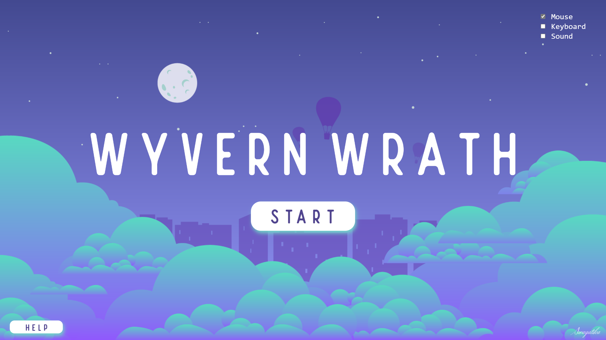
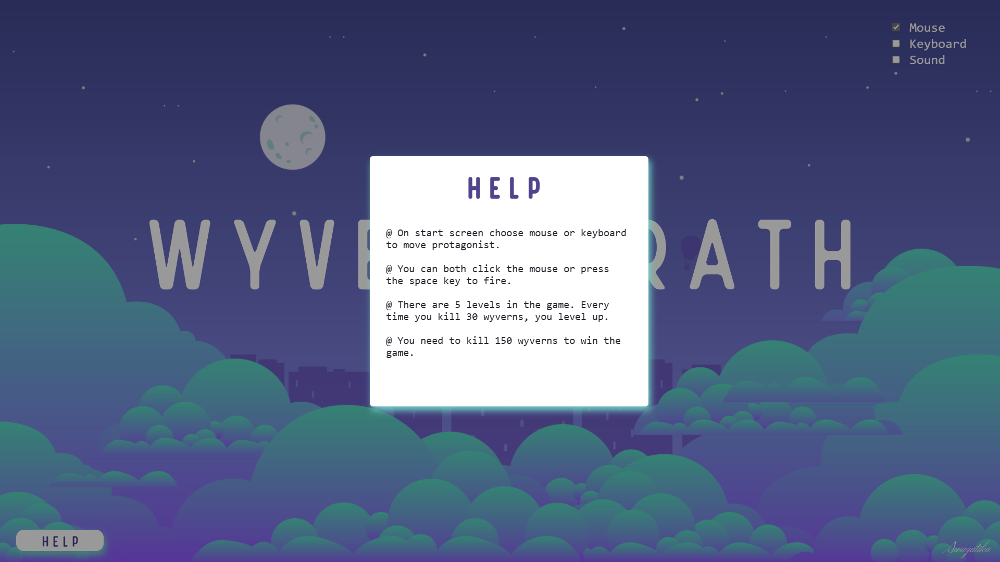
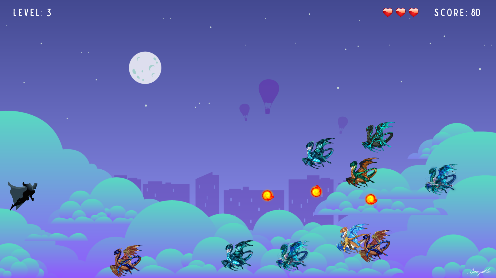
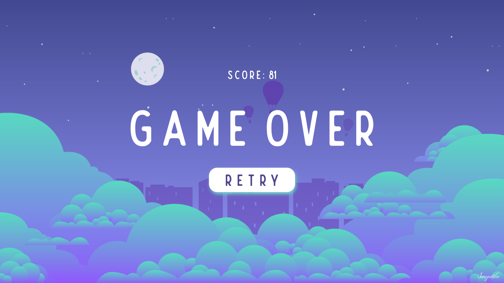

# Wyvern Wrath

This is a 2D game, created using JavaScript, HTML, CSS, and p5 libraries.

## Game Link

[Wyvern Wrath](https://linktodocumentation)

## Screenshots
Start Screen: 

Help Modal:

Play Screen:

Game Over Screen:

Win Screen:

## 🔗 My Profile Links

